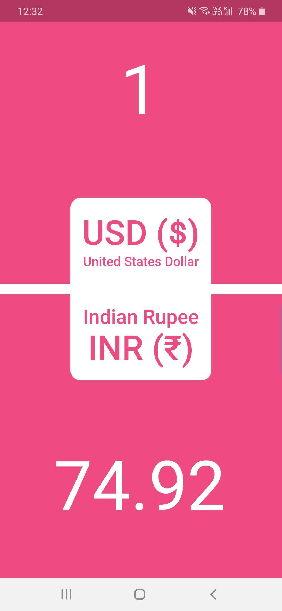
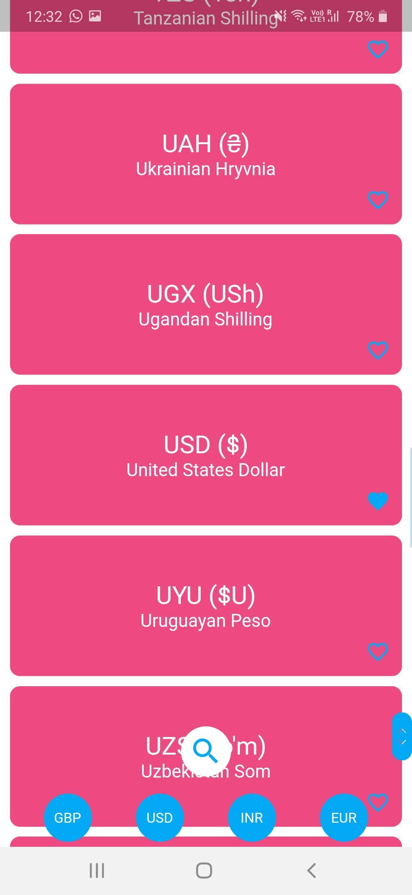
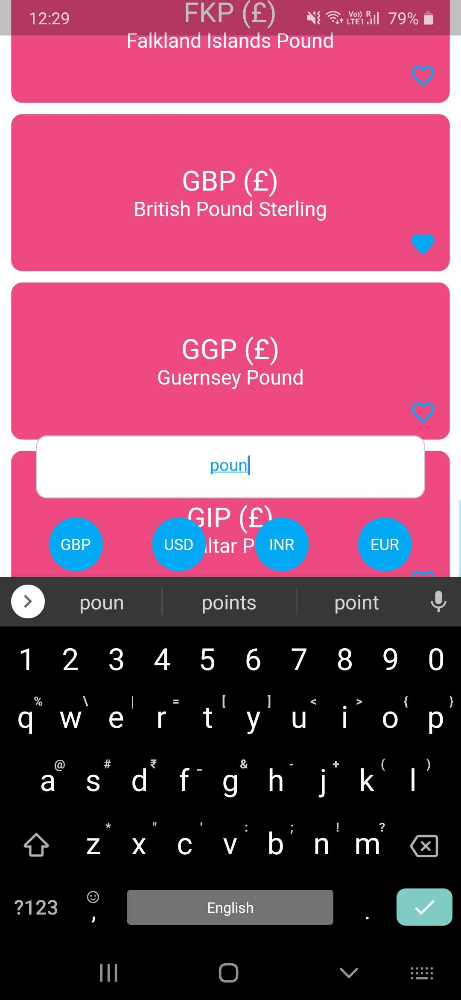

# Convert My Currency

A visually appealing currency converter with 170+ currencies that gets the job done with offline support and no ads.
This project was made in Flutter for both iOS and Android.


||||
| ------------- |:-------------:| -----:|


# Building
You need to obtain your own api key from openexchangerates.org and create a new file in lib/ called key.dart and add the following line into the file
```
const ratesKey = "<YOUR_API_KEY>";
```
replace <YOUR_API_KEY> with your own and build
